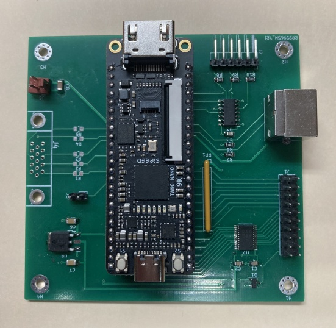

# TRS-80_Model3-4_Keyboard-Display-Adapter
FPGA based Interface to replace the keyboard and/or CRT display of a TRS-80 Model 3 or 4 with a PS2 keyboard and VGA or HDMI monitor.

### Overview

The adapter can be used to replace the keyboard of a TRS-80 Model 3 or 4 computer with a PS2 keyboard and/or the CRT with a VGA or HDMI monitor.  The adapter uses a low cost Nano-9k FPGA module to simulate the keyboard matrix and to capture and reformat the video signal.

